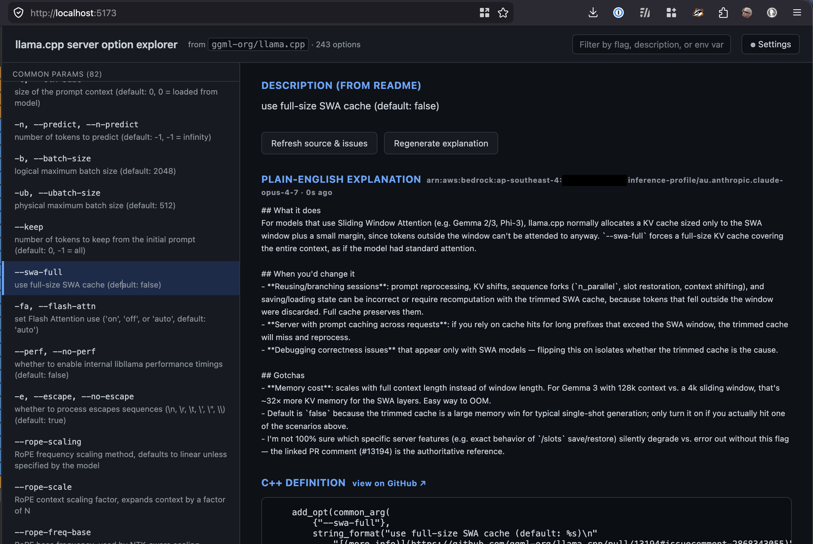
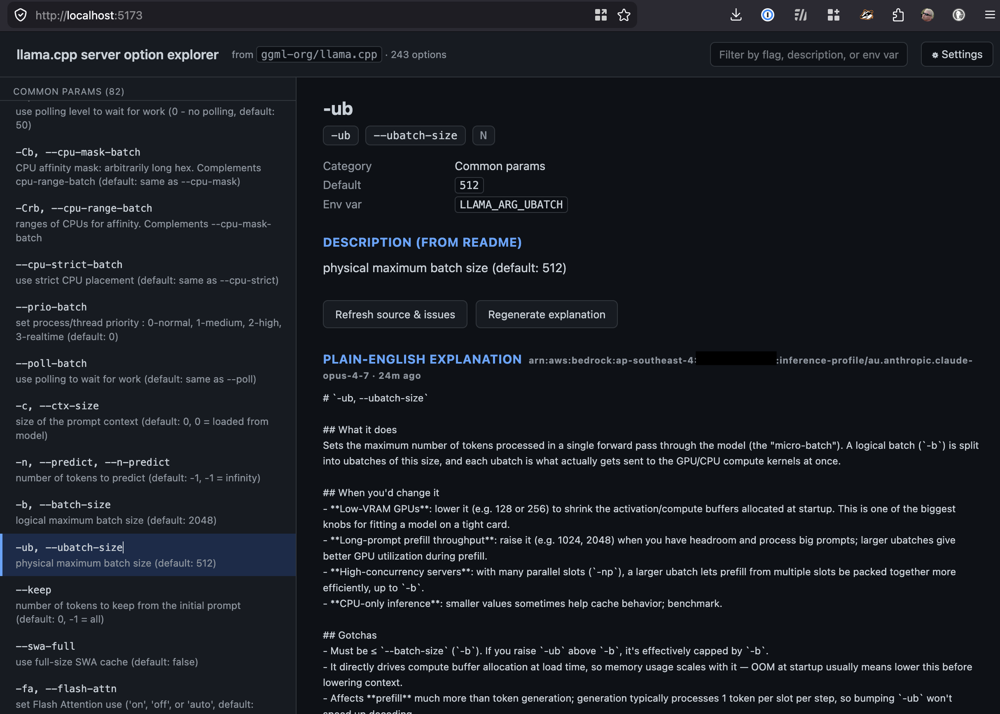
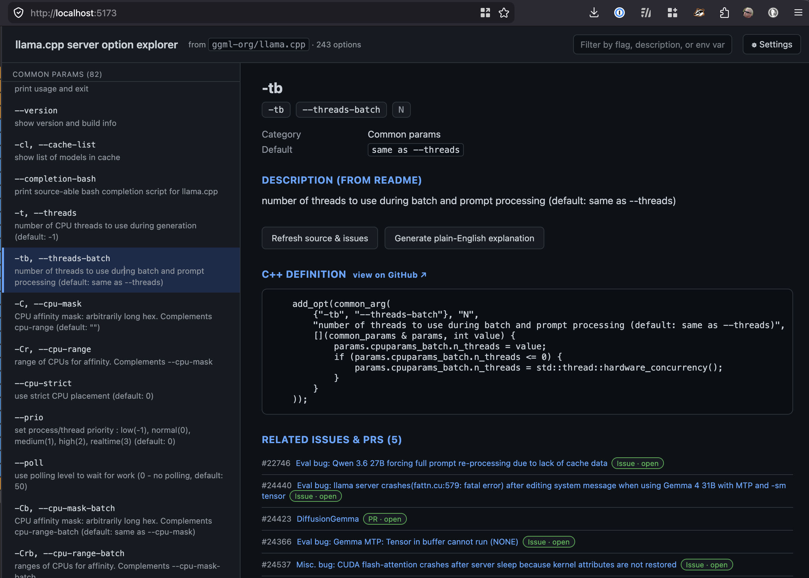
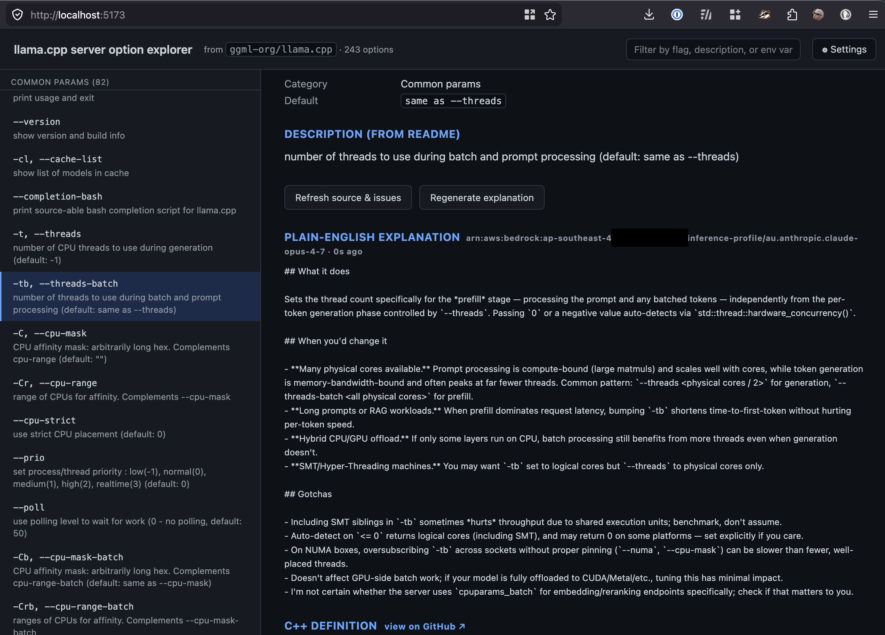

# llama.cpp server option explorer

Local web UI that lets you dig into the CLI options of llama.cpp's tools —
the HTTP server and llama-bench out of the box, with support for adding
custom sources. Each option pulls the README description, the matching C++
definition (when available), related GitHub issues/PRs, and an optional
plain-English explanation generated via AWS Bedrock (Claude Opus).

## Screenshots

### Option detail with generated explanation

Clicking an option opens its detail panel: README description, defaults, env
var, the matching C++ definition (with a link back to the exact line range
on GitHub), and — if you've generated one — a plain-English breakdown of
what the flag does, when you'd change it, and the gotchas. The list on the
left stays available for navigation; selection is highlighted.





### Generating an explanation — before / after

Explanations are generated on demand, not at index time. The README + C++
definition + any related issues are bundled into a single Bedrock call, the
result is cached server-side keyed by option id, and the button flips from
*Generate* to *Regenerate* once cached. The C++ definition and related
issues/PRs are visible without an explanation — the LLM blurb is purely
additive context for terse flags.

**Before** — detail panel for `-tb, --threads-batch` showing the C++
definition and 5 related issues/PRs, with the **Generate plain-English
explanation** button waiting to be clicked:



**After** — same option, post-generation. Plain-English explanation appears
inline with timestamp and model id; the button now reads **Regenerate
explanation**. Result is cached so subsequent loads serve instantly:



## Stack

- **Frontend:** Vite + React 19 + TypeScript
- **Backend:** Hono on Node (TypeScript via `tsx` in dev)
- **Cache:**
  - Server-side: SQLite (`better-sqlite3`) — durable, source of truth
  - Client-side: IndexedDB (`idb`) — instant first-paint mirror
- **LLM (optional):** AWS Bedrock SDK → Claude Opus 4.7 inference profile
  (gracefully no-ops if AWS creds aren't available)

## Cache & validation behaviour

- First load (cold cache) → toast `Loading data…`, fetch upstream, store in
  SQLite + IDB.
- Warm load with stale cache (older than `cache_ttl_hours`, default 24h) →
  toast `Refreshing data…`, serve cached immediately, refresh in background,
  re-render if changed.
- Warm load with fresh cache → toast `Cache current (Xh ago)`, no refetch.
- Per-option detail caches source-block, related-issues, and explanation
  separately, each with the same TTL.

## Install

These scripts download a tarball of `main` (no git history) and build it
in place. Re-run to update; your cache survives.

### macOS

```bash
curl -fsSL https://raw.githubusercontent.com/AlienResidents/llama-cpp-server-explorer/main/scripts/install.bash | bash
```

Default location: `~/Developer/llama-cpp-server-explorer/`. To install
elsewhere, pass an absolute path:

```bash
curl -fsSL https://raw.githubusercontent.com/AlienResidents/llama-cpp-server-explorer/main/scripts/install.bash | bash -s -- ~/code/llama-explorer
```

### Linux

```bash
curl -fsSL https://raw.githubusercontent.com/AlienResidents/llama-cpp-server-explorer/main/scripts/install.bash | bash
```

Default location: `${XDG_DATA_HOME:-$HOME/.local/share}/llama-cpp-server-explorer/`.
Same argument-override convention as macOS.

### Windows

```powershell
iwr -useb https://raw.githubusercontent.com/AlienResidents/llama-cpp-server-explorer/main/scripts/install.ps1 | iex
```

Default location: `%LOCALAPPDATA%\llama-cpp-server-explorer\`. To install
elsewhere, download the script first and pass `-InstallDir`:

```powershell
iwr -useb https://raw.githubusercontent.com/AlienResidents/llama-cpp-server-explorer/main/scripts/install.ps1 -OutFile install.ps1
./install.ps1 -InstallDir "C:\opt\llama-explorer"
```

### WSL2

Use the **Linux** command. The install lands in your Linux filesystem,
which is much faster for `pnpm install` and `pnpm build` than the
`/mnt/c/...` Windows filesystem.

### Audit-first install

If you'd rather review the script before running:

```bash
curl -fsSL https://raw.githubusercontent.com/AlienResidents/llama-cpp-server-explorer/main/scripts/install.bash -o install.bash
less install.bash
bash install.bash           # default location
bash install.bash ~/foo     # custom location
```

### Run

```bash
cd <INSTALL_DIR>
pnpm start
# server listening on http://localhost:8787
```

Then open http://localhost:8787 in your browser. The Hono server serves
both the API and the built client from a single port.

### Pre-flight requirements

The install script checks for these on PATH:

- `node` (22.12+ or 26+) — install via [nvm](https://github.com/nvm-sh/nvm),
  [fnm](https://github.com/Schniz/fnm), Homebrew, or [nodejs.org](https://nodejs.org/).
- `pnpm` — install via `corepack enable && corepack prepare pnpm@latest --activate`,
  or `npm i -g pnpm`.
- `tar` — standard on macOS/Linux. Windows 10 1803+ ships with native `tar`.
- `curl` — standard everywhere; install via package manager if missing.

## Run from source (development)

If you cloned the repo to develop on it:

```bash
pnpm install
pnpm dev
```

- Frontend (Vite): http://localhost:5173 — hot-reload, proxies `/api` to the backend
- Backend (Hono):  http://localhost:8787 — also serves the built client at `/`
  when `dist/client/` exists (after `pnpm build`)
- SQLite DB: `data/explorer.db` (gitignored)

## Sources

The app ships with two preset sources:

| ID            | Parser                       | README                                         | C++ definitions      |
| ------------- | ---------------------------- | ---------------------------------------------- | -------------------- |
| `server`      | `server-readme-table`        | `tools/server/README.md`                       | `common/arg.cpp`     |
| `llama-bench` | `llama-bench-usage-block`    | `tools/llama-bench/README.md`                  | (none — see note)    |

llama-bench parses argv inline in `tools/llama-bench/llama-bench.cpp` rather
than via the `add_opt(common_arg(...))` pattern that `arg.cpp` uses, so we
skip the C++-definition lookup for that source. The README description,
related GitHub issues/PRs, and the LLM explanation still work normally.

**Switch source** via the dropdown in the header. Each source has its own
cache namespace — switching is instant; no refetch unless that source's
cache is stale.

**Add a custom source** in Settings → Sources. Provide an ID, a name, the
raw README URL, an optional `arg.cpp`-style URL, the `owner/repo` for
GitHub issue search, and pick a parser. Custom sources can be deleted;
default sources can be edited but not deleted.

## Settings

Click **⚙ Settings** in the header. The General tab adjusts:

- Cache TTL (hours)
- Toast duration (ms)
- Issue search limit
- Toggles for source-code lookup, issue lookup, LLM explanation
- Bedrock model id + region

The Sources tab manages the source list above. All settings persist
server-side in SQLite. Reset returns all keys to defaults; sources are not
affected by Reset (delete them individually if needed).

## API

All source-scoped routes live under `/api/sources/:sourceId/...`. The cache
status is returned in every payload as `{ data, cache: { age_ms, status, was_refreshed } }`.

| Method | Path                                                | Purpose                                  |
| ------ | --------------------------------------------------- | ---------------------------------------- |
| GET    | `/api/meta`                                         | Boot info: settings, sources, bedrock    |
| GET    | `/api/settings`                                     | Current settings + defaults              |
| PUT    | `/api/settings`                                     | Patch settings                           |
| POST   | `/api/settings/reset`                               | Reset to defaults                        |
| GET    | `/api/sources`                                      | List sources                             |
| POST   | `/api/sources`                                      | Create custom source                     |
| PUT    | `/api/sources/:id`                                  | Update source                            |
| DELETE | `/api/sources/:id`                                  | Delete source (non-default only)         |
| GET    | `/api/sources/:id/options[?force=1]`                | Options for a source                     |
| GET    | `/api/sources/:id/options/:opt[?force=1]`           | Option detail                            |
| POST   | `/api/sources/:id/options/:opt/refresh`             | Force-refresh source + issues            |
| POST   | `/api/sources/:id/options/:opt/explain`             | Generate LLM explanation                 |

All `GET` payloads are wrapped as `{ data, cache: { age_ms, status, was_refreshed } }`.

## Bedrock auth

The Bedrock client uses the default AWS SDK credential chain. Easiest local setup:

```bash
export AWS_PROFILE=...           # or use ambient creds
export AWS_REGION=ap-southeast-4 # or whichever holds your inference profile
pnpm dev
```

Then open the **Settings** modal in the UI and set `bedrock_model_id` to your
inference-profile ARN (or a foundation-model id). It ships empty so the app
stays usable without AWS, and the **Generate explanation** button no-ops
cleanly until both creds and a model id are present.

## App Generation

This app was generated by Claude (Opus 4.7, 1M context) running inside the
[`pi`](https://github.com/earendil-works/pi-coding-agent) coding agent harness,
from the prompts and answers below. Captured verbatim so the design choices
are traceable to the conversation that produced them.

### Initial prompt

> Heya Kestrel! I'd like to build a webapp that takes this readme:
> https://github.com/ggml-org/llama.cpp/blob/master/tools/server/README.md
> and allows a user to dig into the various options for more detailed
> information. I'd like each time a user digs into a particular option, that
> the online source is validated asynchronously for currency. On first load,
> cache all validations, and subsequent serves load cache first with a toast
> saying refreshing data and then dynamically update the content/cache if
> different.

### Clarifying Q&A

**1. Tech stack?** (Next.js / Vite+React / Flask+HTMX / static + service worker)

> Vite + React

**2. Where does it run / where do I create it?**

> Let's store it locally for the time being, so we can test. I'll run it as
> localhost or something first, suggestions for a webserver component would
> be nice.

**3. What is "more detailed information" for an option?** (`arg.cpp` block /
linked issues+PRs / LLM-generated explanation / all of the above)

> The terms used need to be explained e.g. `-cms minimum spacing between
> context checkpoints in tokens` — what does that even mean, and why would
> you change it? All of the above would be a nice thing to have.

**4. What does "validate for currency" mean?** (re-fetch README / re-fetch
source and check flag still exists / both)

> Both

**5. Cache location?** (server-side / client-side / both)

> Both — only update cache if older than a configurable period, default to
> 1d/24h.

**6. Toast UX — confirm the flow.**

> Always show toast. On cold first load, make the toast say `Loading data...`
> and refresh `Refreshing data...` if cache is stale, and for non-stale cache
> `Cache current ($age)`. Keep the toast around for a configurable time
> period, with a default of 2s.

### Follow-up requirements (added mid-build)

**Settings UI.**

> I'd like a settings section so I can update settings through the webui.

**Dependency hygiene.**

> When building this, ensure you have the latest non-vulnerable versions of
> software, and validate online.

Resolved by checking each chosen package's `@latest` version against the
GitHub Security Advisories API for the `npm` ecosystem before pinning. Every
chosen version sits above the highest patched range listed for that package
at the time of writing — see the pinned versions in `package.json`.
